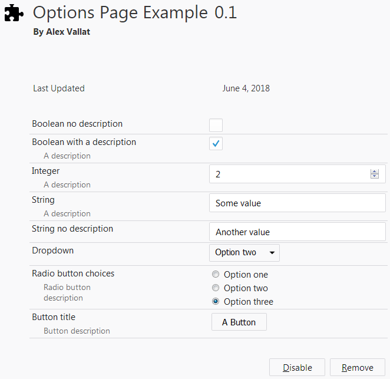

# FirefoxInlineOptions

This library provides a convenient way to present inline options for your firefox addon, matching the classic style of inline options from legacy addons.

The following settings controls are provided:
 * Checkbox (boolean)
 * Numberbox (integer)
 * Textbox (string)
 * Dropdown (string)
 * Radio Buttons (string)
 * Button

## Usage
To use FirefoxInlineOptions in your addon, extract the contents of [Release.zip](https://github.com/AlexVallat/FirefoxInlineOptions/releases/latest) into a subfolder, `options/`, for example. Then, in your manifest, reference the `options.html` page:

    "options_ui": {
        "page": "options/options.html"
    },

Finally, edit the `options/options-config.js` to define the settings that should be shown. Each setting must have a `key`, which is passed to `browser.storage.local.get` and `.set` to read and write the setting value. The setting must also have a `type` describing what sort of control should be used for it. See the `options-config.js` file for more details.

Buttons work by sending a message with their `key` as the message. Your background script can listen for these messages to respond appropriately. See the Example addon for an demonstration of this.
